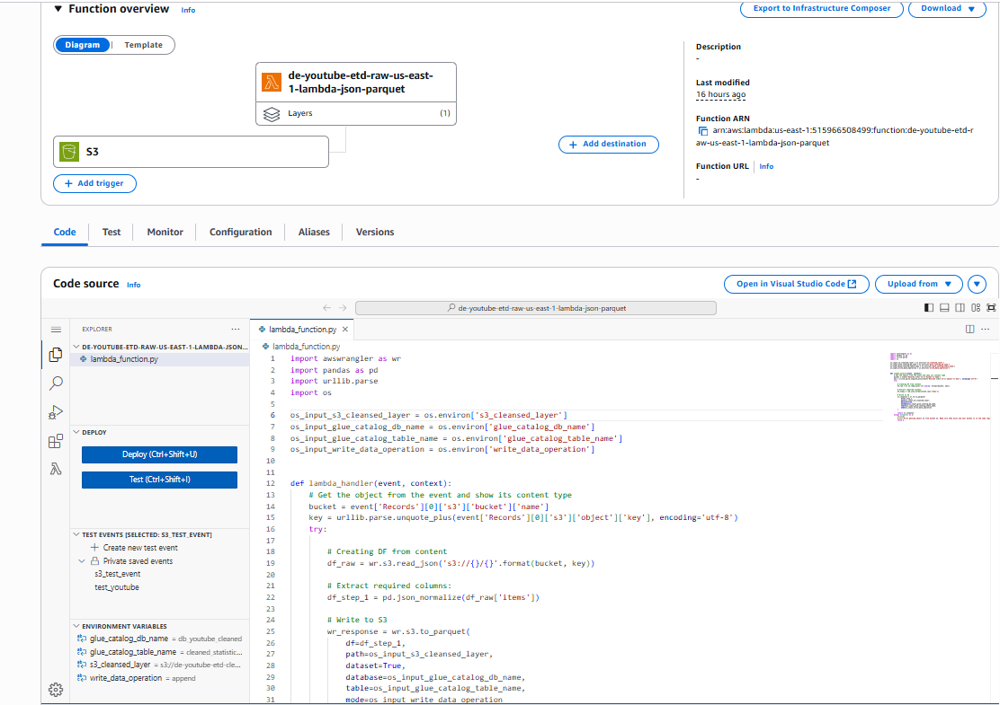

# YouTube Data Engineering Project 🚀

This project is an **end-to-end data engineering pipeline** built on **AWS** to analyze YouTube trending video data across multiple regions.  
The pipeline ingests raw data, processes it into cleansed and enriched datasets, and enables **analytics & reporting dashboards** with AWS QuickSight.  

---

## 📌 Architecture

Our data platform is built using a **Data Lakehouse approach**.

**Key AWS Services Used:**
- **Amazon S3** → Data Lake (Landing, Cleansed, Analytics layers)  
- **AWS Glue Crawlers** → Automated schema discovery & metadata cataloging  
- **AWS Glue ETL (PySpark Jobs)** → Data transformation and enrichment  
- **AWS Lambda** → Serverless data transformation from JSON → Parquet  
- **AWS Athena** → SQL queries on processed datasets  
- **AWS QuickSight** → Dashboards for insights (views, likes, dislikes, regional trends)  
- **Amazon CloudWatch** → Monitoring & alerts  

---

## 📂 Data Flow

### 1. Raw Data Ingestion
Trending YouTube JSON files are uploaded into **S3 Landing Zone**.

Examples include:
- `US_category_id.json`  
- `CA_category_id.json`  
- `GB_category_id.json`  

---

### 2. Schema Detection & Cataloging
AWS Glue **Crawlers** automatically infer schema and register tables in the **Glue Data Catalog**.

---

### 3. ETL Processing
Glue **ETL jobs (PySpark)** transform raw data.
- Filter regions (`US`, `GB`, `CA`)  
- Normalize nested JSON  
- Apply schema mapping  
- Store cleansed Parquet files in **S3 Cleansed Layer**  

---

### 4. Lambda Transformation
AWS Lambda is triggered on new file uploads. It:
- Converts JSON into flattened Parquet  
- Writes processed data to Cleansed Layer in S3  

---

### 5. Analytics & Querying
Athena queries allow interactive SQL analysis directly on S3.

**Example query joining raw statistics with category reference data:**

SELECT * 
FROM "db_youtube_cleaned"."raw_statistics" a
INNER JOIN "db_youtube_cleaned"."cleaned_statistics_reference_data" b 
  ON a.category_id = b.id;

---
## 6. Dashboard (QuickSight)

### Visuals included
- **Total Likes by Content Category** (bar)  
- **Total Views by Content Category** (donut)  
- **Regional Distribution of Views** (pie)  
- **Total Dislikes by Content Category** (bar)  

---

## 7. 🛠️ Tech Stack
- **Languages:** Python, SQL, PySpark  
- **AWS Services:** S3, Glue, Lambda, Athena, QuickSight, CloudWatch  
- **Data Format:** JSON → Parquet  
- **Orchestration:** Step Functions (optional future enhancement)  

---

## 8. 🚀 Reproduce Locally
1. Put raw JSON in S3 **Landing**.  
2. Run Glue **Crawlers**, then **ETL** to write Parquet to **Cleansed**.  
3. Query with **Athena**, create reporting views.  
4. Connect **QuickSight** to Athena and build the dashboard.  

---

## 9. 🧭 Future Enhancements
- Orchestrate with **Step Functions**  
- Load curated datasets into **Redshift**  
- IaC with **Terraform/CloudFormation**, CI/CD  

---

